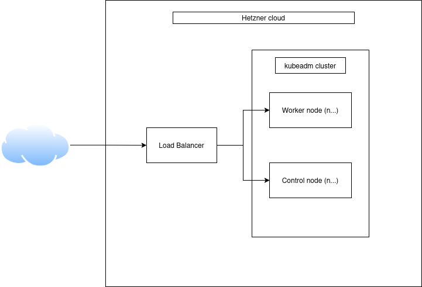

# Mahajaetud.ee IaC

This is an infrastructure as code project for an interactive web application mahajaetud.ee, which is an online map/social network for urban exploration.

## Table of Contents

- [Overview](#overview)
- [Features](#features)
- [Images](#images)
- [Installation](#installation)
- [Configuration](#configuration)

## Overview

This projecct uses Terraform for provisioning hosts on Hetzner Cloud and Ansible for further configuration management. Kubernetes is installed onto the controller/worker nodes through kubeadm. A load balancer sits in front for distributing traffic to pods on kubernetes.

## Features

- Bare-metal kubernetes installation
- Helm chart for application installation
- Kubegres for database hosting
- AWS S3 for backup and Terraform state storage 

## Images
High-level overview


### Installation

Clone the repo
```bash
git clone https://github.com/1nnu/urbex-infrastructure.git
```

Add a public key for hetzner servers to the root of the project
```bash
./id_ed25519.pub
```

Initialize terraform and apply
```bash
terraform init
terraform apply -auto-approve -var "hetzner_api_token=${HETZNER_API_TOKEN}"
```

Install Ansible requirements and run playbook.yaml
```bash
ansible-galaxy collection install -r requirements.yaml
ansible-playbook -i inventory/hcloud.yaml playbook.yaml \
    -e "hetzner_api_token=${HETZNER_API_TOKEN}"
```

## Configuration

The following environment variables are used to configure the application:

| Environment Variable | Description |
|----------------------|-------------|
| `AWS_ACCESS_KEY_ID`  | Access key ID for S3 bucket |
| `AWS_SECRET_ACCESS_KEY` | Secret key for access to S3 bucket |
| `AWS_REGION`         | AWS region where S3 bucket is hosted |
| `S3_BUCKET`           | S3 bucket where application state and backups are stored |
| `HETZNER_API_TOKEN`            | API token for access to Hetnzer Cloud services |

Ansible variables are stored at ./group_vars/all.yaml
Helm chart configuration is done through ./roles/webapp-deployment/templates/values.yaml.j2
